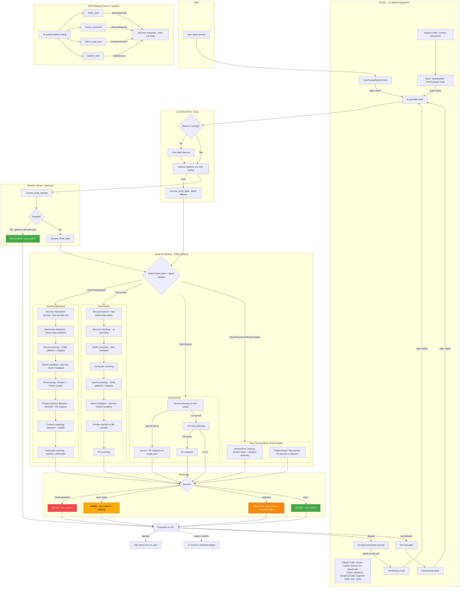

# AI Guardian Hook Flow Diagram (v1.11.0)

```mermaid
graph TD
    subgraph User["User"]
        UP[User types prompt]
    end

    subgraph IDE["AI IDE — 11 Agents Supported"]
        direction TB
        AGENTS["Claude Code, Cursor, Copilot, Gemini CLI, OpenCode,
        Codex, Windsurf, Cline/ZooCode, Augment Code, Kiro, Junie"]
        UP --> H1["UserPromptSubmit hook"]
        H1 -->|stdin JSON| CLI

        AI_RESP[AI Agent processes prompt] -->|wants to use tool| H2["PreToolUse hook"]
        H2 -->|stdin JSON| CLI

        TOOL_EXEC[Tool executes] --> H3["PostToolUse hook"]
        H3 -->|stdin JSON| CLI

        SESSION_END[Session ends / context compacted] --> H4["Stop / SessionEnd / PostCompact hook"]
        H4 -->|stdin JSON| CLI
    end

    subgraph MCP["MCP Advisory Server - optional"]
        MCP_CHECK[AI queries before acting]
        MCP_CHECK --> CHK_PATH[check_path]
        MCP_CHECK --> CHK_CMD[check_command]
        MCP_CHECK --> CHK_MCP[check_mcp_trust]
        MCP_CHECK --> SANITIZE[sanitize_text]
        CHK_PATH -->|allowed/denied| MCP_RESP[Advisory response - does not block]
        CHK_CMD -->|allowed/blocked| MCP_RESP
        CHK_MCP -->|trusted/untrusted| MCP_RESP
        SANITIZE -->|redacted text| MCP_RESP
    end

    subgraph CLI_LAYER["CLI Entry Point - cli.py"]
        CLI[ai-guardian hook] --> AUTO_START{Daemon running?}
        AUTO_START -->|No| START_DAEMON[Auto-start daemon]
        START_DAEMON --> DAEMON_CLIENT
        AUTO_START -->|Yes| DAEMON_CLIENT[Send to daemon via Unix socket]
        DAEMON_CLIENT -->|error| DIRECT[process_hook_data - direct fallback]
    end

    subgraph DAEMON["Daemon Server - server.py"]
        DAEMON_CLIENT --> DAEMON_RECV[_handle_hook_request]
        DAEMON_RECV --> PAUSE{Paused?}
        PAUSE -->|Yes - global or per-directory| ALLOW_PAUSED[Return allow - exit_code 0]
        PAUSE -->|No| PROCESS[process_hook_data]
    end

    subgraph PROCESSING["Hook Processing - TOML patterns"]
        DIRECT --> DETECT_EVENT
        PROCESS --> DETECT_EVENT

        DETECT_EVENT{Detect hook event + agent adapter} -->|UserPromptSubmit| PROMPT_FLOW
        DETECT_EVENT -->|PreToolUse| PRE_FLOW
        DETECT_EVENT -->|PostToolUse| POST_FLOW
        DETECT_EVENT -->|Stop/SessionEnd/PostCompact| SESSION_FLOW

        subgraph PROMPT_FLOW["UserPromptSubmit"]
            P1[Security instructions injection - first prompt only]
            P1 --> P1B[Stack trace detection - reduce false positives]
            P1B --> P2[Secret scanning - TOML patterns + engines]
            P2 --> P2B[Secret validation - liveness check if enabled]
            P2B --> P3[PII scanning - Phase 1 + Phase 2 types]
            P3 --> P4[Prompt injection detection - heuristic + ML engines]
            P4 --> P4B[Context poisoning detection - LLM03]
            P4B --> P5[Transcript scanning - catches ! shell leaks]
        end

        subgraph PRE_FLOW["PreToolUse"]
            T1[Tool permissions - last-match-wins policy]
            T1 --> T2[Directory blocking - .ai-read-deny]
            T2 --> T3[SSRF protection - URL validation]
            T3 --> T4[Config file scanning]
            T4 --> T5[Secret scanning - TOML patterns + engines]
            T5 --> T5B[Secret validation - liveness check if enabled]
            T5B --> T6[Prompt injection in file content]
            T6 --> T7[PII scanning]
        end

        subgraph POST_FLOW["PostToolUse"]
            O1[Secret scanning on tool output]
            O1 -->|secrets found| O2[Secret + PII redaction in single pass]
            O1 -->|no secrets| O3[PII-only scanning]
            O3 -->|PII found| O4[PII redaction]
        end

        subgraph SESSION_FLOW["Stop / SessionEnd / PostCompact"]
            S1[SessionEnd: cleanup session state + violation summary]
            S2[PostCompact: flag session for security re-injection]
        end
    end

    subgraph RESPONSE["Response"]
        P5 --> DECISION
        T7 --> DECISION
        O2 --> DECISION
        O4 --> DECISION
        O3 -->|no PII| DECISION
        S1 --> DECISION
        S2 --> DECISION

        DECISION{Decision}
        DECISION -->|threat detected| BLOCK[BLOCK - exit_code 2]
        DECISION -->|warn mode| WARN[WARN - exit_code 0 + warning]
        DECISION -->|redacted| REDACT[MODIFIED - exit_code 0 + redacted output]
        DECISION -->|clean| ALLOW[ALLOW - exit_code 0]
    end

    ALLOW_PAUSED --> RESP_BACK
    BLOCK --> RESP_BACK[Response to IDE]
    WARN --> RESP_BACK
    REDACT --> RESP_BACK
    ALLOW --> RESP_BACK

    RESP_BACK -->|blocked| IDE_BLOCK[IDE shows error to user]
    RESP_BACK -->|allowed| AI_RESP
    RESP_BACK -->|tool allowed| TOOL_EXEC
    RESP_BACK -->|output modified| AI_GETS[AI receives redacted output]

    style BLOCK fill:#ff4444,color:#fff
    style WARN fill:#ffaa00,color:#000
    style REDACT fill:#ff8800,color:#fff
    style ALLOW fill:#44aa44,color:#fff
    style ALLOW_PAUSED fill:#44aa44,color:#fff
```
